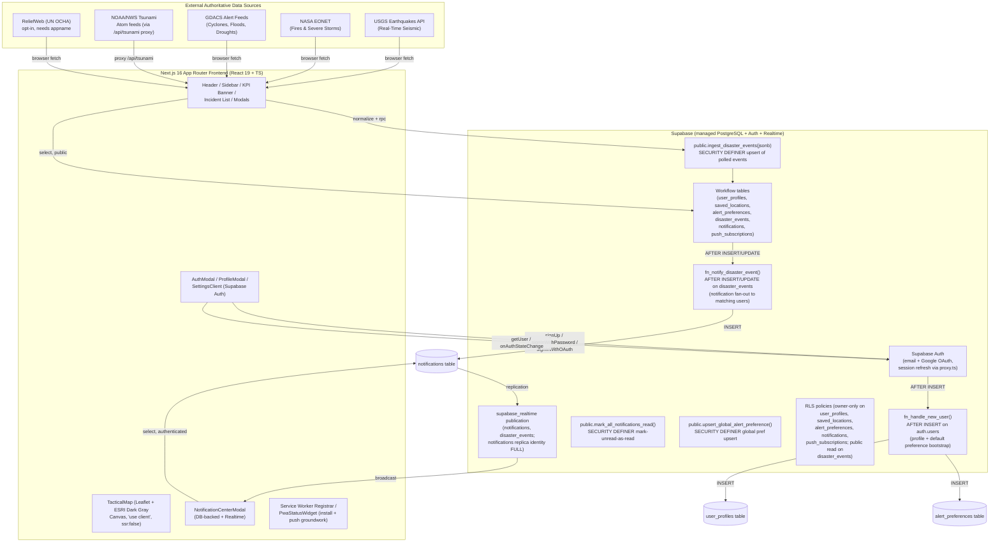

# AegisWatch — System Architecture & Technical Specification

**System:** AegisWatch
**Architecture Pattern:** Next.js App Router frontend + managed Supabase backend (Auth, PostgreSQL, Realtime, Storage-ready)
**Database:** Supabase PostgreSQL (workflow tables, RLS, triggers, RPCs, Realtime publication)
**Frontend Architecture:** Next.js 16 App Router (React 19 + TypeScript) with `'use client'` interactive islands
**Real-Time:** Supabase Realtime (PostgreSQL replication publication → broadcast to subscribed clients)
**Auth:** Supabase Auth (email + password, Google OAuth, session refresh middleware)
**AI Integration:** None in the current build. The app does not call any LLM today; emergency advisory text is deterministic, written by the feed adapters and the notification trigger. (Gemini guidance was in the original roadmap but is not built.)

---

## 1. High-Level Architecture Diagram



---

## 2. End-to-End Operational Data Flow

```
[1. Auth]       User signs up (email or Google) via AuthModal.
                Email signup: supabase.auth.signUp({ email, password,
                options: { emailRedirectTo, data: { avatar_url } } }).
                Google: supabase.auth.signInWithOAuth({ provider: 'google' }).

[2. Auth trigger]  AFTER INSERT on auth.users fires fn_handle_new_user():
                  - inserts into user_profiles (id, email, full_name, avatar_url)
                    using ON CONFLICT DO NOTHING (no target) — cannot fail signup
                    even if user_profiles has no unique index on id.
                  - inserts the default global alert_preference
                    (watch everywhere, all types, HIGH+, in-app on) if none exists.
                  Both inner inserts are wrapped in BEGIN…EXCEPTION so a failure
                  never rolls back the auth.users insert.

[3. Session]    Browser client (src/lib/supabase.ts, @supabase/ssr
                createBrowserClient, single cached instance) holds the session.
                proxy.ts refreshes the session cookie on every request and protects
                /settings for unauthenticated visits.

[4. Feed poll]  Browser polls the live feeds every 60s:
                  - USGS (2.5_day + 4.5_week GeoJSON)
                  - NASA EONET (open events, limit 300)
                  - GDACS (TC/FL/DR SEARCH, 7-day window, Green/Orange/Red)
                  - /api/tsunami (proxied NOAA NTWC + PTWC Atom feeds)
                  - ReliefWeb (only if NEXT_PUBLIC_RELIEFWEB_APPNAME is set)

[5. Normalize]  Each feed adapter normalizes its payload into the unified
                DisasterEvent shape (id, type, title, locationName, region,
                coordinates [lat,lng], severity, status, timestamp, timeAgo,
                summary, metrics, primarySource, externalUrl, sourceFeed,
                isLiveFeed:true, isIndiaFocus).

[6. Ingest]     Browser calls public.ingest_disaster_events({ p_events: [...]  })
                (SECURITY DEFINER RPC). Upserts into disaster_events by id.
                The INSERT/UPDATE fires fn_notify_disaster_event().

[7. Fan-out]    fn_notify_disaster_event() matches each new/updated event against
                every user's alert_preferences (category membership, min_severity
                threshold, distance from a saved location when location-bound,
                30-minute per-event cooldown, dedupe key, 12-hour freshness gate
                on insert) and inserts a notification row per matching user.
                Notifications are created only by this SECURITY DEFINER trigger —
                clients hold no INSERT grant on notifications.

[8. Realtime]   notifications and disaster_events are in the supabase_realtime
                publication (notifications uses replica identity FULL so UPDATE
                events carry every column). The NotificationCenterModal subscribes
                and new rows appear in-app instantly.

[9. Client read]  The dashboard reads disaster_events (public SELECT) to render
                  the map + incident list + KPI banner + sidebar counts. The
                  notification center reads notifications (authenticated SELECT,
                  owner-only RLS). user_profiles + alert_preferences are read by
                  the profile/settings modals (owner-only RLS).
```

---

## 3. Technology Stack Specification & Rationale

### 3.1 Frontend Stack

| Technology | Version | Purpose & Rationale |
|---|---|---|
| **Next.js** | `16.3.4` (App Router, Turbopack in dev) | React framework with file-based routing, server/client component split, and `'use client'` islands for the interactive map and modals. |
| **React** | `19.x` | Component foundation. |
| **TypeScript** | `5.x` (`strict`) | Compile-time safety across GeoJSON payloads and Supabase types. |
| **Tailwind CSS** | `3.4.x` | Utility styling configured with the Stitch tactical tokens (`surface-container`, `primary`, `tertiary`, `error`, etc.). |
| **Leaflet** | `1.9.x` | Tile-based map rendering (ESRI World Dark Gray Canvas). Chosen over MapLibre for zero-config dark basemap with no API key. |
| **Lucide React** | latest | SVG iconography (Mail, Lock, ShieldCheck, Zap, X, User, Bell, MapPin, etc.). |
| **Material Symbols Outlined** | latest | Notification bell icon in the header. |
| **`@supabase/ssr`** | latest | `createBrowserClient` + `createServerClient` for session handling across App Router server components, client components, and the proxy middleware. |
| **next/dynamic** | native | Dynamic import with `ssr: false` for `TacticalMap` so Leaflet never runs during server rendering. |

### 3.2 Backend (managed — Supabase)

| Technology | Role | Purpose & Rationale |
|---|---|---|
| **Supabase Auth** | Authentication | Email + password signup/login, Google OAuth, email confirmation, password reset. Session refresh is done in `proxy.ts` (App Router middleware renamed from `middleware.ts`). |
| **PostgreSQL (Supabase)** | Database | Holds the workflow tables (`user_profiles`, `saved_locations`, `alert_preferences`, `disaster_events`, `notifications`, `push_subscriptions`), RLS policies, triggers, and RPCs. |
| **Supabase Realtime** | Real-time | `supabase_realtime` publication streams `notifications` and `disaster_events` to subscribed clients. `notifications` uses replica identity `FULL`. |
| **Supabase Storage (ready)** | File storage (future) | Bucket + RLS for avatar file uploads is not wired yet; avatars are URL-based today. `push_subscriptions` table is present for the Web Push phase. |

### 3.3 What is NOT in the build (honest)
- **No Java/Spring Boot server.** The original roadmap described one; the project's actual backend converged on Supabase.
- **No PostGIS.** Spatial work uses a pure-arithmetic haversine km function (`fn_haversine_km`) and bounding-box checks, not PostGIS geometry types. This keeps the schema independent of extension provisioning.
- **No Gemini / AI guidance.** The app does not call any LLM today. Advisory text is deterministic.
- **No Web Push delivery yet.** `push_subscriptions` table exists; the subscription + send flow is a later phase.
- **No avatar file upload yet.** Avatars are URL-based today (paste a URL, or get one from Google).

---

## 4. Repository & Directory Structure

```text
DisasterWatch/
├── frontend/                     # Next.js 16 App Router client
│   ├── src/
│   │   ├── app/                  # App Router routes
│   │   │   ├── page.tsx          # Dashboard hub
│   │   │   ├── layout.tsx        # Root layout (fonts, meta, providers)
│   │   │   ├── settings/page.tsx # Settings shell
│   │   │   ├── reset-password/   # Password reset confirmation
│   │   │   └── api/tsunami/route.ts  # NOAA/NWS tsunami feed proxy
│   │   ├── components/           # UI components
│   │   │   ├── AuthModal.tsx
│   │   │   ├── ProfileModal.tsx
│   │   │   ├── SettingsClient.tsx
│   │   │   ├── Header.tsx
│   │   │   ├── Sidebar.tsx
│   │   │   ├── KPIBanner.tsx
│   │   │   ├── FilterBar.tsx
│   │   │   ├── TacticalMap.tsx
│   │   │   ├── IncidentList.tsx
│   │   │   ├── IncidentDetailModal.tsx
│   │   │   ├── NearbyAlertsModal.tsx
│   │   │   ├── RecentAlertsModal.tsx
│   │   │   ├── NotificationCenterModal.tsx
│   │   │   ├── EmergencyDisclaimer.tsx
│   │   │   ├── PwaStatusWidget.tsx
│   │   │   └── RelayStatusFooter.tsx
│   │   ├── lib/
│   │   │   ├── supabase.ts       # Single canonical browser Supabase client (@supabase/ssr)
│   │   │   ├── preferences.ts    # user_profiles + alert_preferences data layer
│   │   │   ├── notifications.ts  # notifications read + mark-read + Realtime subscribe
│   │   │   └── pwa.ts            # Service worker + notification helpers
│   │   ├── services/
│   │   │   └── disasterService.ts# Feed adapters (USGS, NASA EONET, GDACS, tsunami, ReliefWeb)
│   │   │                          # + aggregation, India focus, counts
│   │   ├── types/
│   │   │   └── disaster.ts       # DisasterEvent, DisasterType, severity, status, etc.
│   │   ├── utils/supabase/
│   │   │   ├── client.ts         # Delegates to src/lib/supabase.ts
│   │   │   ├── server.ts         # createServerClient for SSR/route handlers
│   │   │   └── middleware.ts     # (legacy name; the live middleware is src/proxy.ts)
│   │   └── proxy.ts              # App Router middleware: session refresh + /settings protection
│   ├── public/                   # Icons, manifest, offline fallback
│   ├── supabase/                 # (top-level convenience copy of the SQL files)
│   ├── .env                      # LOCAL ONLY — Supabase URL + anon key + service_role key (not in git)
│   ├── next.config.mjs
│   └── package.json
├── supabase/
│   ├── schema.sql                # Idempotent full schema (tables, RLS, triggers, RPCs, grants, Realtime)
│   ├── fix-signup.sql            # Signup-recovery trigger fix (run in SQL Editor if signup breaks)
│   └── .env                      # LOCAL ONLY — service_role key for applying schema (not in git)
├── docs/
│   ├── STATUS.md                 # Current system deliverables & talking points
│   ├── Memory.md                 # Active session state
│   ├── Architecture.md           # This file
│   ├── Phases.md                 # Roadmap (rewritten around Supabase)
│   ├── PRD.md                    # Product vision (see §8 reconciliation note)
│   ├── Design.md                 # Stitch design tokens (unchanged, still accurate)
│   └── Rules.md                  # Dev + AI safety guardrails (updated to real stack)
├── .env.example                  # Supabase env var blueprint (committed)
└── README.md                     # Project overview & quick start
```

---

## 5. Database Schema (Supabase PostgreSQL)

```mermaid
erDiagram
    auth_users ||--o{ user_profiles : "mirrored by fn_handle_new_user trigger"
    auth_users ||--o{ saved_locations : "owner"
    auth_users ||--o{ alert_preferences : "owner"
    auth_users ||--o{ notifications : "recipient"
    auth_users ||--o{ push_subscriptions : "owner"
    disaster_events ||--o{ notifications : "generates via fn_notify_disaster_event"
    saved_locations ||--o{ alert_preferences : "location-bound preference"

    auth_users {
        uuid id PK
        string email
        string email_confirmed_at
        string role
        jsonb raw_user_meta_data
        timestamp created_at
    }

    user_profiles {
        uuid id PK FK auth.users(id) ON DELETE CASCADE
        text email UK
        text full_name
        text avatar_url
        text role default 'user'
        timestamptz created_at
        timestamptz updated_at
    }

    saved_locations {
        uuid id PK
        uuid user_id FK auth.users(id) ON DELETE CASCADE
        text label
        double latitude
        double longitude
        boolean is_primary
        timestamptz created_at
    }

    alert_preferences {
        uuid id PK
        uuid user_id FK auth.users(id) ON DELETE CASCADE
        uuid location_id FK saved_locations(id) ON DELETE CASCADE (nullable = global)
        text[] disaster_types default '{}'
        integer radius_km default 500
        text min_severity default 'MEDIUM'
        boolean in_app_enabled default true
        boolean push_enabled default false
        boolean email_enabled default false
        timestamptz created_at
        timestamptz updated_at
    }

    disaster_events {
        text id PK (upstream id, e.g. 'usgs-abc123')
        text type
        text title
        text location_name
        text region
        double latitude
        double longitude
        text severity default 'LOW'
        text status default 'ACTIVE'
        text summary
        text primary_source
        text external_url
        jsonb metrics default '{}'
        text source_feed
        timestamptz occurred_at
        timestamptz created_at
        timestamptz updated_at
    }

    notifications {
        uuid id PK
        uuid user_id FK auth.users(id) ON DELETE CASCADE
        text disaster_event_id FK disaster_events(id) ON DELETE CASCADE
        text risk_level
        text title
        text body
        boolean is_read default false
        text channel default 'in_app'
        text dedupe_key
        timestamptz created_at
        timestamptz read_at
    }

    push_subscriptions {
        uuid id PK
        uuid user_id FK auth.users(id) ON DELETE CASCADE
        text endpoint UK
        text p256dh
        text auth
        text user_agent
        timestamptz created_at
        timestamptz last_seen_at
    }
```

### 5.1 Key schema details
- **`user_profiles`**: `id` references `auth.users(id)` and is the primary key. `email` is unique. A hand-created table may lack a unique index on `id`; `schema.sql` contains a defensive block that creates `user_profiles_id_uidx` if missing (and skips with a warning on duplicate key).
- **`alert_preferences`**: one global row (`location_id IS NULL`) + one per saved location. Enforced with two partial unique indexes (`alert_preferences_global_uidx` where `location_id IS NULL`, `alert_preferences_location_uidx` where `location_id IS NOT NULL`) because a plain UNIQUE can't express the "NULL = global" semantics.
- **`notifications`**: unique index on `(user_id, dedupe_key)` so a dedupe-key collision silently drops a repeat (`ON CONFLICT (user_id, dedupe_key) DO NOTHING`). No INSERT RLS policy — notifications are only ever created by the `fn_notify_disaster_event()` trigger (SECURITY DEFINER).
- **`disaster_events`**: `id` is the upstream event id, so ingestion is idempotent (`ON CONFLICT (id) DO UPDATE SET ...` in `ingest_disaster_events`).

---

## 6. API Specifications

### 6.1 Supabase client-side calls (the real "API")

| Operation | Supabase call | Access |
|---|---|---|
| Sign up (email) | `supabase.auth.signUp({ email, password, options: { emailRedirectTo, data: { avatar_url } } })` | anon |
| Sign in (email) | `supabase.auth.signInWithPassword({ email, password })` | anon |
| Sign in (Google) | `supabase.auth.signInWithOAuth({ provider: 'google', options: { redirectTo } })` | anon |
| Reset password | `supabase.auth.resetPasswordForEmail(email, { redirectTo })` | anon |
| Current user | `supabase.auth.getUser()` / `supabase.auth.onAuthStateChange()` | anon (gets session) |
| Update profile metadata | `supabase.auth.updateUser({ data: { full_name, location, ... } })` | authenticated |
| Update password | `supabase.auth.updateUser({ password })` | authenticated |
| Read own profile | `client.from('user_profiles').select(...).eq('id', userId).maybeSingle()` | authenticated (RLS) |
| Save own profile | `client.from('user_profiles').upsert({ id, full_name, avatar_url, updated_at })` | authenticated (RLS) |
| Read own alert prefs | `client.from('alert_preferences').select(...).eq('user_id', userId)...` | authenticated (RLS) |
| Upsert global pref | `client.rpc('upsert_global_alert_preference', { p_disaster_types, p_min_severity, p_radius_km, p_in_app_enabled, p_push_enabled })` | authenticated (RPC grant) |
| Read notifications | `client.from('notifications').select(...).eq('user_id', userId)...` | authenticated (RLS) |
| Mark all read | `client.rpc('mark_all_notifications_read')` | authenticated (RPC grant) |
| Ingest polled events | `client.rpc('ingest_disaster_events', { p_events: [...] })` | anon + authenticated (RPC grant) |
| Read disaster events | `client.from('disaster_events').select(...)` | anon + authenticated (public SELECT) |

### 6.2 Route handlers (Next.js App Router)
- **`GET /api/tsunami`** — proxies NOAA/NWS NTWC + PTWC Atom feeds (no CORS otherwise), caches for 120s (`revalidate = 120`), returns `{ feeds: [{ id, centre, xml }] }`. Parsing is deliberately left to the client (DOMParser handles namespaces correctly).

### 6.3 Supabase RPCs (SECURITY DEFINER)
- **`ingest_disaster_events(p_events jsonb) -> integer`** — upserts an array of normalized events into `disaster_events` by id; returns the count of rows inserted/updated.
- **`mark_all_notifications_read() -> integer`** — marks the current user's unread notifications read; returns the count.
- **`upsert_global_alert_preference(p_disaster_types, p_min_severity, p_radius_km, p_in_app_enabled, p_push_enabled) -> alert_preferences`** — upserts the current user's global alert preference (handles the partial unique index correctly).

---

## 7. Real-Time & Notifications

- **Publication:** `supabase_realtime`. `schema.sql` adds `notifications` and `disaster_events` to it if they're not already present, and sets `notifications` replica identity to `FULL`.
- **What streams:** new and mutated `notifications` rows (so marking a notification read propagates), and `disaster_events` changes.
- **Client subscription:** `NotificationCenterModal` calls `subscribeToNotifications(supabase, userId, (row) => ...)` and prepends newly arrived rows to the local list, plus fires a browser notification via the PWA `showLocalNotification` helper when permitted.
- **Fan-out trigger:** `fn_notify_disaster_event()` runs AFTER INSERT or UPDATE on `disaster_events`. Deterministic matching only:
  - hazard category membership (`disaster_types` array or empty = all),
  - min_severity threshold (via `fn_severity_rank`),
  - distance from a saved location when the preference is location-bound (via `fn_haversine_km`),
  - 30-minute per-event cooldown (skip if a notification for this event was created in the last 30 minutes),
  - dedupe key (`<event_id>:<severity>:<status>`) so a severity escalation still notifies while repeats of the same state are dropped,
  - 12-hour freshness gate on INSERT (backfill rows older than 12h are not announced; severity escalations on existing events still notify).

---

## 8. Reconciliation Note (PRD vs. Reality)

The original `PRD.md` and roadmap describe a **Java 21 + Spring Boot 3.x backend with PostgreSQL + PostGIS + Redis**, with Spring Security JWT auth, SSE real-time, and a Gemini AI guidance phase. That architecture is **not** what is running.

The live runtime is:
- **Frontend:** Next.js 16 (App Router) + React 19 + TypeScript + Tailwind CSS + Leaflet.
- **Backend:** Supabase (Auth + PostgreSQL workflow tables + Realtime + Storage-ready). No separate application server.
- **Real-time:** Supabase Realtime (PostgreSQL replication publication), not SSE.
- **AI guidance:** not built. Advisory text is deterministic.

The PRD's product *vision* (multi-source ingestion, deterministic risk, explainer guidance, nearby assistance, historical analytics) still stands as the aspiration. The implementation has taken a different — and currently working — shape around Supabase. Faculty reviewing the docs should read `STATUS.md` and `Memory.md` as the source of truth for what is actually running, and treat `PRD.md` §1–§7 as the product vision and `PRD.md` §8 (once added) as the reconciliation.
